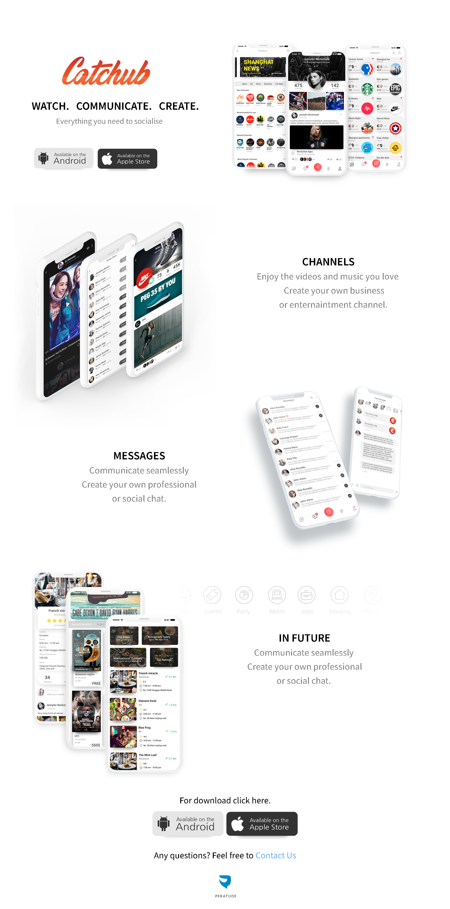

# CatchHub 

## Table of contents

- [Overview](#overview)
  - [Screenshot](#screenshot)
  - [Links](#links)
- [My process](#my-process)
  - [Built with](#built-with)
  - [What I learned](#what-i-learned)
  - [Continued development](#continued-development)
- [Author](#author)
- [Acknowledgments](#acknowledgments)

## Overview

CatchHub is a clone project that I built for practice purposes when I was new to front-end development. The goal was to recreate a static website layout for desktop screens, focusing on structuring the UI with HTML and CSS. This project is not responsive and is one of the first projects I developed to enhance my skills in web design.

### Screenshot

- **CatchHub : Desktop design**

### Links

- Solution URL: [https://github.com/hoor23/CatchHub.git](https://github.com/hoor23/CatchHub.git)
- Live Site URL: [https://hoor23.github.io/CatchHub/](https://hoor23.github.io/CatchHub/)

## My process

### Built with

- HTML5: Used for page structure and layout.
- CSS3: Used for styling the page elements, including fonts and layout design.
- Google Fonts (Source Sans Pro): Applied custom fonts for a modern look.
- Flexbox: For creating a flexible and structured page layout.

**Note: This project is only designed for desktop screens and is not responsive.**

### What I learned

- This was one of the first projects I built, and it helped me understand the basics of HTML and CSS.
- I learned to use CSS Flexbox for layout control.
- This project was a great introduction to handling web page styling, but also taught me the importance of responsive design.

### Continued development

Looking forward, I plan to:

- Make the website responsive, so it works across all devices.
- Introduce JavaScript for interactivity and improved user experience.
- Refactor the code to follow best practices I have learned since building this project.

## Author
- Frontend Mentor - [hoor23](https://www.frontendmentor.io/profile/hoor23)
- Github - [hoor23](https://github.com/hoor23)
- LinkedIn - [Hoor Seyda](www.linkedin.com/in/hoor-seyda-901176222)

## Acknowledgments

Special thanks to:

- Online resources that helped me understand front-end development.
- My early practice projects, which were crucial in building my foundational knowledge.
